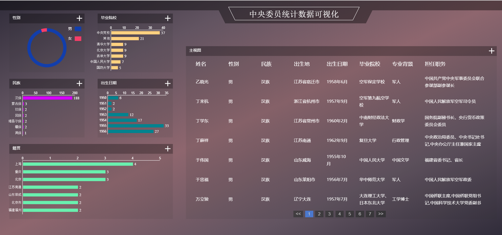
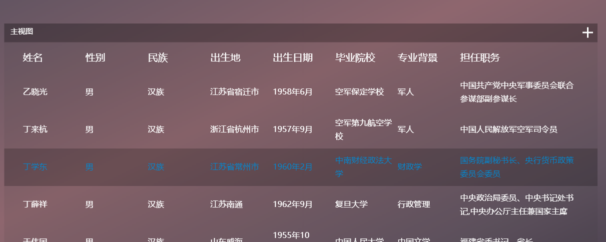
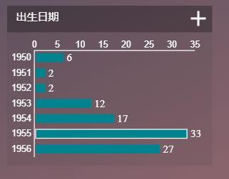
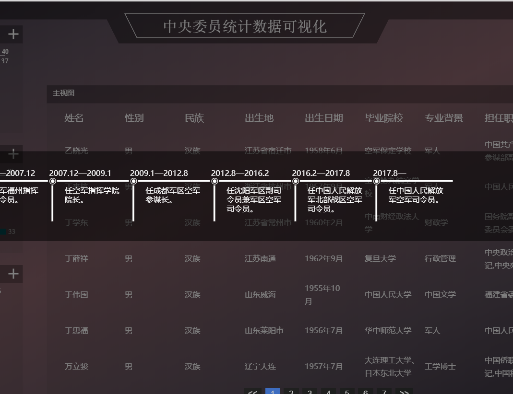
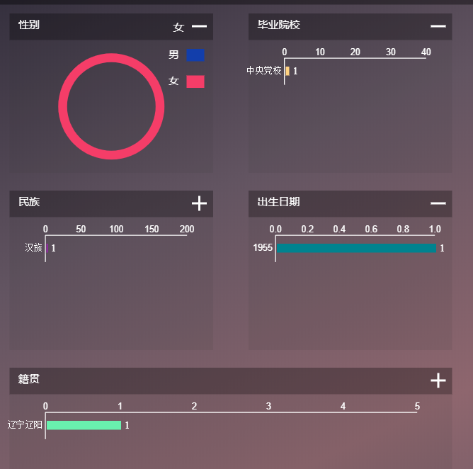
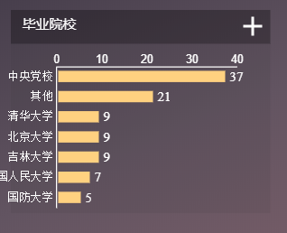
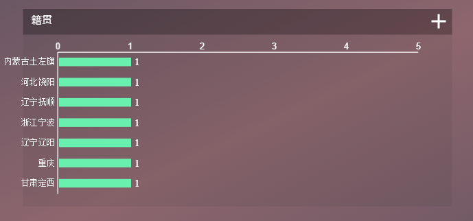
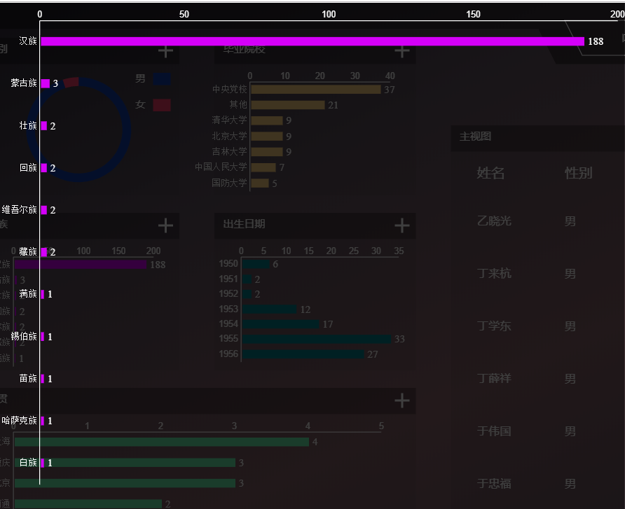

    <h1>
        数据可视化hw10报告
    </h1>

    姓名:冯传恒 
    学号:717030210003

### 数据的描述和分析

##### 1)  数据的描述和分析

- **数据描述**

这份数据是一个`csv`文件,一共有204条数据,**数据规模不大**,因此不必采用特数的方法进行处理,每条数据有9个属性,分别是:

姓名, 性别, 民族, 出生地, 出生日期, 毕业院校, 专业背景, 担任职务, 履历

其中前8个属性的字段较短,履历的字段较长.数据虽然给出了很多信息,但是给出的**信息格式不一致**,导致**数据解析和处理非常复杂**.比如日期中就有好几种类型:

只有年份的,

> 1982—1984,上海材料研究所九室科研人员

有年份和月份的,

> 2005.08—2006.11,财政部教科文司司长；

或者起始日期只有年份终止日期年份和月份都有的,

> 1996—2003.10,空军司令部军训部部长、云南航空兵训练基地司令员、成都军区空军副参谋长、空军武汉基地司令员、空军武汉指挥所主任

还有起始日期和终止日期一样的

> 2007—2007,上海市委书记,上海警备区党委第一书记

- **可能展开的的分析点**

可以分析某个委员的职业生涯,升迁记录与其职业,毕业院校,民族等属性的关系,也可以分析各种属性在委员中数量的占比的影响

##### 2) 设计宗旨和设计过程

- **为什么没有加入地图可视化**

如**1)**中所说,给出的数据特殊情况过多,需要在数据的统一化和解析下很多功夫.人员履历信息的地图可视化应该是非常有吸引力的,但是需要花费大量时间,很难在短时间内完成,遇到的主要问题只要在于**履历信息中给出的地点不明确**,导致和具体地理信息匹配的难度很大,比如

> 1994—1997,国家国有资产管理局办公室主任兼人事教育司司长；

在没有其他信息的情况下,很难靠知道`国家国有资产管理局办公室`的具体地理位置在哪里,虽然实际上我们是可以知道的,但是这样的数据太多,如果一条一条去处理显示是不切实际的,所以这一种情况行不通

- 设计思想

    为了解(tao)决(bi)以上问题,我采用了一种更直接的可视化方式,通过列表和直方图的方式来显示人员信息,而由于履历的信息过多,所以不在列表里直接呈现,需要`click`或者`onmouseover`事件来触发显示.

    此外,我采用饼状图显示男女比例,采用直方图显示各个院校,地方,民族,年龄段相关联的人员信息,**可以通过点击关联的直方图来进行数据筛选**

##### 3) 可视化结果描述

- 界面框架

    界面框架分为六个部分:

    1. 性别框架
    2. 毕业院校框架
    3. 民族框架
    4. 出生日期框架
    5. 籍贯框架
    6. 主视图框架

- 交互

该可视化网页采用了较多的交互手段,大致有一下几种;

1. 高亮

    

2. 单击展开详细信息

    单击直方图空白处,可以显示完整的直方图,**而且可以滑动鼠标滚轮上下滚动**

    

    单击人员信息空白处,可以查看该人员的详细履历,,**而且可以滑动鼠标滚轮左右滚动**

3. 单击统计图中的数据进行数据筛选,`-`表示此项作为筛选条件,单击`-`变为`+`,表示不作为筛选条件

    

    4. 该网页中加入了生成直方图,扇形图时的过度效果

- 发现

1. 人员中有很多毕业于中央党校,共37人,而其他学校中最多的清华,北大,吉林大学中也只有9人

    

2. 人员中有很多人出生于*1955-1957*年,几乎将近100人

    

3. 中央委员中的女性几乎都来自北方,共10人,其中4人毕业于中央党校,3人毕业于吉林大学

    

4. 中央委员中只有10个少数民族,其中人数最多的民族为蒙古族,3人.其他都为1或2个人.而汉族人一共188名.说明少数民族人数偏少

    